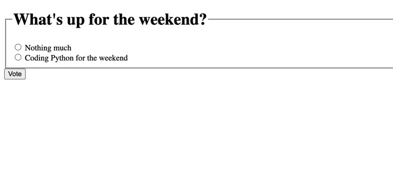

# Simple poll application using Django framework

## Features

- This poll consists of questions and a list of choices for users to pick a choice from
- When option has been selected, the next page shows the result and the choice that has the highest number of votes

#### Pages from the poll app

### Reference <https://docs.djangoproject.com/en/4.0/intro/>

